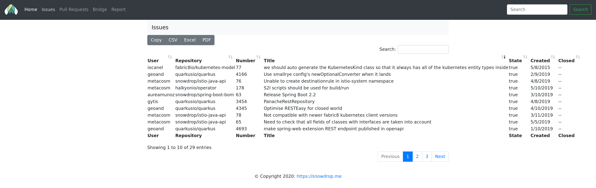
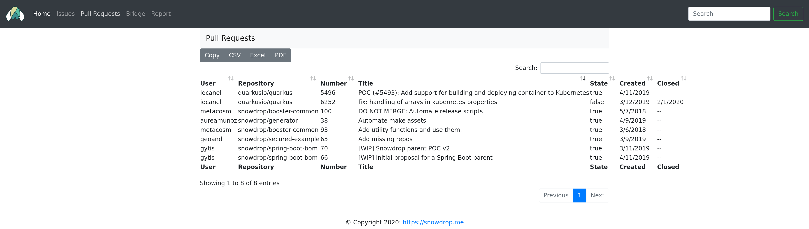

# Table of Contents

   * [Table of Contents](#table-of-contents)
   * [Snowdrop Bot](#snowdrop-bot)
      * [Features](#features)
      * [Installation](#installation)
         * [Database](#database)
         * [Github](#github)
         * [Google APIS](#google-apis)
         * [Jira](#jira)
      * [Running](#running)
         * [Default Profile](#default-profile)
            * [Persistence and configuration (default)](#persistence-and-configuration-default)
         * [Production Profile](#production-profile)
            * [Persistence and configuration (production)](#persistence-and-configuration-production)
      * [Services](#services)
         * [Users](#users)
            * [Operations](#operations)
         * [Associate list](#associate-list)
            * [Operations](#operations-1)
      * [Issue tracking](#issue-tracking)
      * [Pull Request tracking](#pull-request-tracking)
      * [Forked repository issue bridging](#forked-repository-issue-bridging)
      * [Google Docs Report Generation](#google-docs-report-generation)
      * [Release preparation](#Release preparation)
      * [Kubernetes / OpenShift deployment](#kubernetes--openshift-deployment)
      * [Appendix](#appendix)
         * [Create secrets](#create-secrets)
            * [Associate list](#associate-list-1)
         * [Building and publishing the image to quay with buildah](#building-and-publishing-the-image-to-quay-with-buildah)

# Snowdrop Bot
A bot for automating snowdrop related tasks

## Features

- [Issues tracking](#issue-tracking) across multiple organizations and repositories
- [Pull request tracking](#pull-request-tracking) across multiple organization and repositories
- [Forked repository issue bridging](#forked-repository-issue-bridging)
- [Google Docs report generation](#google-docs-report-generation)

## Installation

To prevent adding personal information to github, create an alternate resources folder at `src/main/local-resources` and copy the `src/main/resources/application.properties`
file into it. All changes should be made to this file. This folder is excluded in `.gitignore`.

### Database

For the persistence needs of this application `h2` has been used.
The database is configured to store files under `~/.snowdrop-bot/db`.
So you will either need to create the folder and ensure that you have write
access, or reconfigure the application to store files somewhere else.

You can specify where h2 will store files by editing: `quarkus.datasource.url`.

### Github

The application will need to access github. So you are going to need an access token.

The token can be configured either via `github.token` property or `GITHUB_TOKEN`
environment variable.

> NOTE: The `github.token` property is configured to have it's value filled with the [Maven Rsource plugin Filter capabilities](https://maven.apache.org/plugins/maven-resources-plugin/examples/filter.html).
> It can be easily filled by adding -Dgithub.token=<the token> to the maven compilation statement.

### Google APIS

To upload the generated reports to Google Documents, you will need to enable the
Google Documents API. Once enabled, you will need to store the provided
`credentials.json` file under `/.snowdrop-bot/google/credentials.json`.
Again the location is configurable via `google.docs.credentials.file` property.

### Jira

The application will need to access jira and for that it will need the credentials.

This information can be provided either by the application.properties file or environment variables.

`application.properties`:

```properties
jira.username=my-jira-username
jira.password=my-jira-password
```

Environment variables:

```bash
$ export JIRA_USERNAME=my-jira-username
$ export JIRA_PASSWORD=my-jira-password
```

## Running

To build the bot application, execute the following command:

    ./mvnw clean package

The parameters are passes using the argument `-D`

    ./mvnw -Dgithub.token=<the token> clean package

Then run it using maven

    ./mvnw compile quarkus:dev

or the jar file created

    java -jar target/quarkus-app/quarkus-run.jar

Another option is to pass it when launching the application

    java -Dgithub.token=<the token> clean package -jar target/quarkus-app/quarkus-run.jar

> NOTE:* The `github.token` is required and there are several possibilities of informing it:
>  * `application.properites`
>  * environment variable
>  * system properties
>
> More information at [QUARKUS - CONFIGURING YOUR APPLICATION](https://quarkus.io/guides/config#using-configproperties)


### Default Profile
To avoid unnecessary traffic on the github API (which is subject of rate
limiting) the default profile has the core features (e.g. bridge and reporting disabled).

You can enable them selectively through the UI, or use a different profile (e.g.
production).

#### Persistence and configuration (default)
The default profile uses /data/snowdrop-bot as the root for configuration and database files.


### Production Profile
The production profile has all features enabled by default.
Additionally, everything related to file persistence or file configuration is
configured under `/data/snowdrop-bot` which is a volume friendlier path
(e.g. when running on Kubernetes).

#### Persistence and configuration (production)
The production profile uses `/data/snowdrop-bot` as the root for configuration and database files.

## Services

### Users

User management is done by REST API.

The default admin user is `admin` and the password is also `admin`.

#### Operations

All user operations exist under the `/security/user` URL.

**Create user:**
* `/create`
  * Parameters:
    * `username`:
    * `password`:
    * `role`: [admin,user]

**List users:**
* `/list`: Returns the existing users

**Delete user:**
* `/delete`: Deletes a user
  * Parameters:
    * `username`:
  * Comments:
    * A user cannot remove himself

**Change password:**
* `/changepw`: Changes the password of the authenticated user
  * Parameters:
    * `password`:

### Associate list

Relation between user id of eath issue source (GITHUB, JIRA) and the name to be shown in the report.

The associate table can be maintained with the following REST services:

#### Operations

```bash
$ curl -X POST -d associate=<github-id> -d alias=<bot-alias> -d source=[GITHUB,JIRA,...] -d name="<Associante Name>" localhost:8080/associate/create
```

A list of the associates can be obtained using the list service.

```bash
$ curl -X GET localhost:8080/associate/list
```

## Issue tracking

Provides a unified view of all `active` issues across multiple repositories.
The criteria for selecting issues are the following:

- exist in repositories of configured organizations (`github.reporting.organizations`)
- assigned to configured users (`github.users`)
- the assigned username has forked the repository
- were open within the configured time frame (the week bounded by `github.reporting.day-of-week` & `github.reporting.hours`)

Those issues, can be exported in csv, excel or pdf.

**NOTE:** At the moment we don't track the activity of the issue in any way. In
other words, we do not filter out `stale` issues.



## Pull Request tracking

Provides a unified view of all `active` pull requests across multiple repositories.
The criteria for selecting issues are the following:

- exist in repositories of configured organizations (`github.reporting.organizations`)
- assigned to configured users (`github.users`)
- the assigned username has forked the repository
- were open within the configured time frame (the week bounded by `github.reporting.day-of-week` & `github.reporting.hours`)



Those pull requests, can be exported in csv, excel or pdf.

**NOTE:** At the moment we don't track the activity of the pull requests in any way. In
other words, we do not filter out `stale` pull requests.

## Forked repository issue bridging

When working across multiple different organizations owned by different teams
with variable access levels, it's important to be able to have an aggregated view
of the pending issues. This is important for things like:

- tracking
- scheduling
- reporting

Lack of permissions in 3rd party repositories make it difficult to manage and
aggregate. In other cases its not allowed to track repositories across
organizations.

Whatever, the reason forking the repository and using a bridge to `clone` issues
of interest is a possible solution.

This bot provides this feature and allows you to configure the following
options:

- source repositories (`github.bridge.source-repos`)
- target organization (`github.bridge.target-organization`)
- terminal label (the label to use to mark an issue as closed `github.bridge.terminal-label`)

Once the user has forked a repository under the `target` organization, a few more things need to be done:
- Enable issues in the forked repo:
    1. On GitHub, navigate to the main page of the repository
    1. Under your repository name, click Settings
    1. Under Features, unselect the Issues checkbox.
- Create the aforementioned terminal label:
    1. On GitHub, navigate to the main page of the repository.
    1. Under your repository name, click Issues or Pull requests.
    1. Above the list of issues or pull requests, click Labels.
    1. To the right of the search field, click New label.
    1. Under "Label name", type `upstream/closed`.
    1. Under "Label description", type `The issue has been closed in the upstream repository`.
    1. Under "Label color", type `#078c64`.

## Google Docs Report Generation

It's possible to combine information found in `issues` and `pull requests` and
present them in `Google Docs`.

This can be done by selecting the `Reporting` tab and clicking the `generate` button.

This requires the setup mentioned in [Google APIS](#google-apis).
The id of the target document can be specified using `google.docs.report.document-id`.

## Release preparation

Before deploying the application, we need modify the version in the pom file and tag the code on the github repository.

Run the `mvn release:prepare` command in order to achieve this goal. You will be prompted for the versions to use, here you can find some values examples:

| Release Version          | Tag or Label     | New development version                                      |
| ------------------------ | ---------------- | ------------------------------------------------------------ |
| 0.15                     | 0.15             | 0.16-SNAPSHOT                                                |

These values should be adjusted for every release.

## Kubernetes deployment

Before to deploy the bot on a kubernetes cluster, it is needed to create some resources described here after the secrets containing the credentials used

1. Verify that PV volumes exist to bound the PVC of the bot with a volume of 2Gi. See [appendix](#appendix) to create a PV if needed.
2. Create a secret for the github token using the key stored under the shared `password-store` (see github.com/snowdrop/pass).

**REMARK**: Add the namespace parameter `-n` to specify where the secrets should be created

```bash
export GITHUB_TOKEN=`pass show snowdrop/github.com/snowdrop-bot/token`
kubectl create secret generic snowdrop-github --from-literal=GITHUB_TOKEN=$GITHUB_TOKEN
```

3. Do the same for the `jira.username`, `jira.password` and `jira.users`

```bash
export jira_users=<the jira users>
export jira_username=snowdrop-jirabot
export jira_password=`pass show snowdrop/rh/jira/snowdrop-jirabot`
kubectl create secret generic snowdrop-jira \
    --from-literal=jira.username=$jira_username \
    --from-literal=jira.password=$jira_password \
    --from-literal=jira.users=$jira_users
```

4. Create the secret containing tge list of the `github.users` (e.g.: )

```bash
kubectl create secret generic snowdrop-associated \
    --from-literal=github.users=git-user-1,git-user-2,git-user-3,...
```

5. Deploy the Bot like the service and ingress resource
```bash
kubectl apply -f ./deploy/all.yml
```

## Appendix

###

A PV could be created using the following `kubectl` command:

```bash
cat << EOF | kubectl apply -f -
apiVersion: v1
kind: PersistentVolumeClaim
metadata:
  name: snowdrop-db-claim
spec:
  accessModes:
    - ReadWriteOnce
  resources:
    requests:
      storage: 2Gi
  volumeMode: Filesystem
EOF
```

